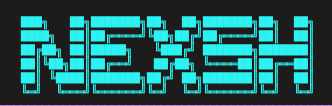

<div align="center">
<a href="https://ummaty.org/gaza"></img></a>

# NexSh 🤖



[](https://crates.io/crates/nexsh)


[](https://opensource.org/licenses/MIT)
[](https://github.com/M97Chahboun/nexsh/actions/workflows/rust.yml)
[](https://github.com/M97Chahboun/nexsh)

Next-generation AI-powered shell using ReAct pattern with OpenRouter

[Installation](#installation) •
[Features](#features) •
[Usage](#usage) •
[Configuration](#configuration) •
[Contributing](#contributing)


</div>


# Features

- 🧠 **ReAct Agent Pattern** - Uses Reasoning and Acting framework for intelligent command generation
- 🤖 **200+ AI Models** - Access to models from OpenAI, Anthropic, Google, Meta, and more via OpenRouter
- 📊 **Human-Friendly Format** - Simple text-based responses for maximum reliability (99%+ parsing success)
- 🎯 **Model Presets** - Quick selection of Free, Programming, or Reasoning optimized models
- 🔄 **Smart conversion** - Translates your words into precise shell commands
- 💭 **Transparent Reasoning** - See the AI's thought process before executing commands
- 🔇 **Verbose Mode** - Toggle between detailed reasoning steps or clean final answers
- 🎨 **Interactive experience** - Colorful output with intuitive formatting
- 📝 **Enhanced history** - Search and recall past commands easily
- 🛡️ **Safety first** - Warns before executing potentially dangerous commands
- 🚀 **Multiple modes** - Interactive shell or single-command execution
- 💻 **Cross-platform** - Works on Linux, macOS, and Windows
- ❌ **Command failure explanations** - Offers explanations and potential solutions when a command fails
# Installation

### From GitHub Releases

You can download pre-built binaries for your platform from our [GitHub Releases](https://github.com/M97Chahboun/nexsh/releases) page.

1. Visit the [Releases](https://github.com/M97Chahboun/nexsh/releases) page
2. Download the appropriate file for your platform:
   - Windows: `nexsh-windows.zip`
   - macOS: `nexsh-macos.tar.gz`
   - Linux: `nexsh-linux.tar.gz`
3. Verify the download using SHA256 checksum:
   ```bash
   # Download both the binary and its checksum
   curl -LO https://github.com/M97Chahboun/nexsh/releases/latest/download/nexsh-linux.tar.gz
   curl -LO https://github.com/M97Chahboun/nexsh/releases/latest/download/nexsh-linux.sha256
   
   # Verify the checksum (Linux/macOS)
   echo "$(cat nexsh-linux.sha256)  nexsh-linux.tar.gz" | shasum -a 256 --check
   ```
4. Extract the archive:
   ```bash
   # For Linux/macOS
   tar xzf nexsh-linux.tar.gz
   
   # For Windows
   unzip nexsh-windows.zip
   ```
5. Move the binary to a directory in your PATH:
   ```bash
   # Linux/macOS
   sudo mv nexsh /usr/local/bin/
   
   # Windows: Move nexsh.exe to a directory in your PATH
   ```
   
### Using Cargo (Recommended)

```bash
cargo install nexsh
```

### From Source

```bash
# Clone the repository
git clone https://github.com/M97Chahboun/nexsh.git
cd nexsh

# Build and install
cargo build --release
sudo cp target/release/nexsh /usr/local/bin/
```

## 🛠️ Setup

### First-time configuration:

**Important:** You need an OpenRouter API key to use NexSh.

1. Get your API key from [OpenRouter](https://openrouter.ai/keys)
2. Run the initialization command:

```bash
nexsh init
```

3. Enter your OpenRouter API key when prompted
4. The key will be securely stored in your system's config directory

**Note:** The API key is stored in the config file, not read from environment variables.

### Migrating from Old Version:

If you're upgrading from a previous version that used Gemini:

```bash
# Run migration automatically (happens on first run)
nexsh

# Or manually trigger migration
nexsh migrate

# Check migration status
nexsh migration-status
```

The migration will:
- Convert your old Gemini config to OpenRouter format
- Preserve your history and context
- Suggest equivalent OpenRouter models
- Keep your old config as backup

# Configuration

### Configuration Options

```bash
nexsh init
```

Follow the prompts to configure the tool:

```plaintext
🤖 Welcome to NexSh Setup!
Enter your OpenRouter API key: your_openrouter_api_key
Enter history size (default 1000):
Enter max context messages (default 100):
Enable verbose mode to show all thoughts and actions? (y/N): n

📋 Model Selection
Choose a preset:
  1. Free models (recommended for getting started)
  2. Programming models (optimized for code)
  3. Reasoning models (advanced problem-solving)
  4. Browse all models

Select preset (1-4, default 1): 2
```

Your configuration is now stored in the default location and used by `nexsh`.

| Setting                | Description                                             | Default                   |
| ---------------------- | ------------------------------------------------------- | ------------------------- |
| `api_key`              | Your OpenRouter API key                                 | Required                  |
| `history_size`         | Number of commands to keep in history                   | 1000                      |
| `max_context_messages` | Maximum messages to keep in AI context                  | 100                       |
| `model`                | The AI model to use                                     | anthropic/claude-sonnet-4 |
| `verbose`              | Show all reasoning steps (true) or clean output (false) | false                     |

### Available Models

NexSh supports 200+ models via OpenRouter with intelligent presets:

**🎯 Model Presets:**
- **Free**: Perfect for getting started without costs
- **Programming**: Optimized for code generation and technical tasks
- **Reasoning**: Advanced problem-solving and complex analysis

**Recommended for ReAct Pattern:**
- `anthropic/claude-sonnet-4` - Best reasoning capabilities (default)
- `anthropic/claude-3.5-sonnet` - Fast and intelligent
- `deepseek/deepseek-r1` - Specialized reasoning model
- `openai/gpt-4-turbo` - Excellent structured output consistency

**Other Options:**
- `openai/gpt-4o` - OpenAI's latest multimodal model
- `google/gemini-2.5-flash` - Fast Google model
- `meta-llama/llama-3.3-70b-instruct` - Open source option

**Free Models:**
- `google/gemini-flash-1.5` - Free tier
- `meta-llama/llama-3.1-8b-instruct:free` - Free tier
- `qwen/qwen3-coder:free` - Free coding model

**Interactive Model Selection:**
```bash
nexsh
→ models

📋 Model Selection
Choose an option:
  1. Browse all models (fetched from API)
  2. Use preset: Programming (optimized for code)
  3. Use preset: Reasoning (advanced problem-solving)
  4. Use preset: Free (free-tier models only)
```

# Usage

### Interactive Shell Mode

The AI assistant uses the ReAct (Reasoning and Acting) pattern to understand your requests and execute commands intelligently.

```bash
nexsh
```

Example session showing ReAct pattern in action:

```bash
$ nexsh
🤖 Welcome to NexSh! Type 'exit' to quit or 'help' for assistance.

→ check which project im in
💭 Thought: User wants to know their current project context...
🔧 Action: pwd && ls -la && git remote -v 2>/dev/null
🤖 → You're in the nexsh project at /Users/username/Development/nexsh

→ show me system memory usage
💭 Thought: User wants to see memory usage statistics...
🔧 Action: free -h
              total        used        free      shared  buff/cache   available
Mem:           15Gi       4.3Gi       6.2Gi       386Mi       4.9Gi        10Gi

→ find files modified in the last 24 hours
💭 Thought: Need to find recently modified files...
🔧 Action: find . -type f -mtime -1
./src/main.rs
./Cargo.toml
./README.md
```

### Single Command Mode

```bash
nexsh -e "show all running docker containers"
```

### Key Commands

| Command       | Action                                         |
| ------------- | ---------------------------------------------- |
| `exit`/`quit` | Exit the shell                                 |
| `help`        | Show available commands                        |
| `models`      | Browse and select AI models with presets       |
| `verbose`     | Enable verbose mode (show all reasoning steps) |
| `verbose off` | Disable verbose mode (show only final answers) |
| `Ctrl+C`      | Cancel current operation                       |
| `Ctrl+D`      | Exit the shell                                 |
| `Up/Down`     | Navigate command history                       |

### Verbose Mode

Control how much detail you see from the AI:

```bash
# Enable verbose mode - see all reasoning steps
→ verbose
✅ Verbose mode enabled - will show all thoughts and actions

# Disable verbose mode - cleaner output
→ verbose off
✅ Verbose mode disabled - will show only final answers
```

**Verbose ON** (detailed):
```
→ check which project im in
💭 Thought: User wants to know their current project context...
🔧 Action: pwd && ls -la && git remote -v 2>/dev/null
📊 Observation: /Users/username/Development/nexsh...
🤖 → You're in the nexsh project
```

**Verbose OFF** (clean):
```
→ check which project im in
💭 Analyzing your request...
🤖 → You're in the nexsh project at /Users/username/Development/nexsh
```

# Contributing

We welcome contributions! Here's how to get started:

1. Fork the repository
2. Create your feature branch (`git checkout -b feature/amazing-feature`)
3. Commit your changes (`git commit -m 'Add some amazing feature'`)
4. Push to the branch (`git push origin feature/amazing-feature`)
5. Open a Pull Request

Please read our [Contribution Guidelines](CONTRIBUTING.md) for more details.

## 📝 License

MIT License - See [LICENSE](LICENSE) for full details.

## 🙏 Acknowledgments

- OpenRouter for providing access to 200+ AI models
- Anthropic, OpenAI, Google, Meta, and other AI providers
- The Rust community for amazing crates and tools (schemars, serde, tokio, etc.)
- All contributors who helped shape this project

## ✨ What's New in v0.9.0

- **Human-Friendly Format**: Simplified text-based output format for 99%+ parsing reliability
- **Model Presets**: Quick access to Free, Programming, and Reasoning models
- **Verbose Mode**: Toggle between detailed reasoning or clean output
- **Enhanced Model Selection**: Interactive browser with preset categories
- **Better Error Handling**: Improved parsing with automatic fallback mechanisms
- **Improved UX**: Spinner shows during AI processing, cleaner output display
- **Async Improvements**: Fixed runtime nesting issues

See [CHANGELOG_v0.9.0.md](CHANGELOG_v0.9.0.md) for full details.

## 🧠 About ReAct Pattern

NexSh uses the ReAct (Reasoning and Acting) framework, which combines:
- **Reasoning**: The AI thinks through the problem and plans its approach
- **Acting**: The AI takes action based on its reasoning
- **Observation**: The AI observes the results and adjusts if needed

This creates a more transparent and reliable AI assistant that shows its thought process before executing commands.

## 📊 Human-Friendly Output Format

NexSh uses a simple text-based format for maximum reliability and ease of use:

**How it works:**
1. **Simple Structure**: AI responds with clear field-value pairs
2. **Easy Parsing**: Line-by-line parsing eliminates complex JSON errors
3. **Human Readable**: Easy to understand and debug
4. **Backward Compatible**: Falls back to JSON if needed

**Benefits:**
- 🎯 **99%+ Parsing Success**: Eliminates complex JSON parsing errors
- 📝 **Human Readable**: Easy to understand AI responses
- 🚀 **Better Reliability**: AI models handle simple text better than nested JSON
- 🔧 **Easy Debugging**: Clear format makes troubleshooting simple

**Response Format:**
```
Thought: <AI's reasoning about what you want>
Action: <shell command to execute, or "" if just responding>
Dangerous: <true or false - safety flag>
Category: <system|file|network|package|text|process|other>
Final Answer: <optional message shown to user>
```

**Example Response:**
```
Thought: User wants to see all files including hidden ones
Action: ls -lah
Dangerous: false
Category: file
Final Answer: Listing all files in the current directory
```

## �📱 Connect

- **Author**: [M97Chahboun](https://github.com/M97Chahboun)
- **Report issues**: [Issue Tracker](https://github.com/M97Chahboun/nexsh/issues)
- **Follow updates**: [Twitter](https://twitter.com/M97Chahboun)

<div align="center">
Made with ❤️ by <a href="https://github.com/M97Chahboun">M97Chahboun</a>
</div>
